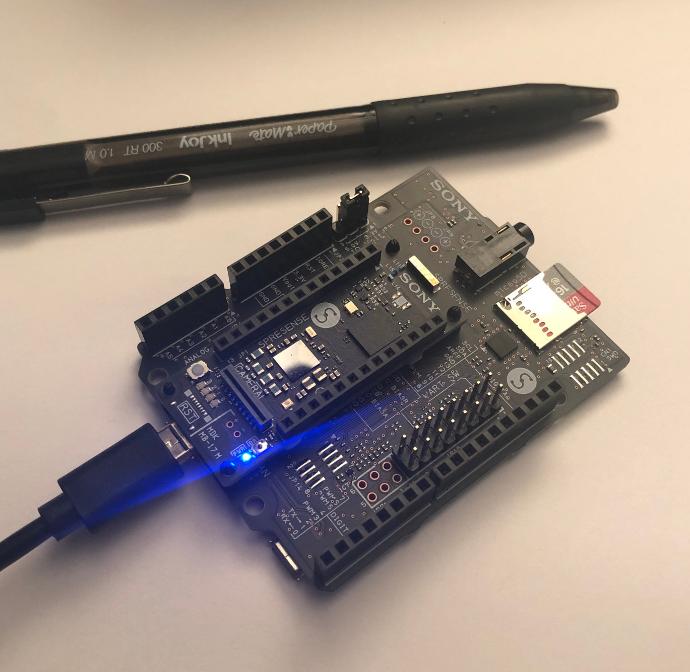

# 1. MicroPipeline

## 1.1. Background

### 1.1.1. Background - MicroPipeline

This project supports:

- the python evaluation of Keras ACDNET3 models
- the conversion of ACDNET3 models to TFLite 
- the deployment of applications to evaluate the accuracy of the models onto both Sony Spresense and x86_64 Ubuntu 20.04

### 1.1.2. Background - ACDNET3

[ACDNet3](https://github.com/mohaimenz/acdnet3) is a Acoustic Classification using Deep Neural Net with 3 Blocks Neural Net

The model architecture has been exclusively designed and developed by:
- MD Mohaimenuzzaman,  PhD student (Deep Learning and IoT) at Monash University, FIT CCI
- Bernd Meyer, Professor Dr. rer. nat., Assoc. Dean Graduate Research at Monash University, FIT CCI

The model architecture has been shown to achieve very high accuracy. Further studies have shown that use of [Taylor pruning](https://arxiv.org/abs/1611.06440) the reduce the number of parameters sufficiently that the ACDNET3 model can be deployed onto microcontroller devices, despite SRAM and Flash constraints.

### 1.1.3. Basic steps

Typical use of this project follows the these steps:

1. Pull MicroPipeline Repository
2. Setup MicroPipeline (1.3)
3. Convert models to TFLite (1.4)
4. Project model deployment
   1. Setup Data sources (1.5)
   2. TFLITE_x86_64
      1. Copy `model.cc` to target project directory
      2. Configure project
      3. Build project
      4. Execute project
      5. View activity.log file on microSD card to review inference results in detail
   3. TFLITE_MICRO
      1. Copy `model.cc` to target project directory
      2. Copy data to microSD card, then insert card into Spresense
      3. Build project      
      4. Upload to Sony Spresense
      5. Connect and execute project
      6. View activity.log file on microSD card to review inference results in detail

## 1.2. Acquiring the repository

The project is designed intentionally to pull into external dependencies as git source code submodule repositories.  This ensures there is suitable path to upgrade those dependencies, without modifying the project.

```bash
git clone --recurse-submodules https://github.com/victorromeo/MicroPipeline.git
cd MicroPipeline
```

### 1.2.1. Dependencies

This repository has the following git submodule dependencies

| Dependency     | URL                                                     | Branch            | Path                                              | Comment                                  |
| -------------- | ------------------------------------------------------- | ----------------- | ------------------------------------------------- | ---------------------------------------- |
| ACDNet3        | https://github.com/mohaimenz/acdnet3.git                |                   | ext/ACDNet3                                       | Main model source                        |
| TensorFlow     | https://github.com/victorromeo/tensorflow               | v2.3.1_transpose  | ext/tensorflow                                    | Supports Tranpose TFLite micro operation |
| Flatbuffers    | https://github.com/google/flatbuffers.git               | v1.12.0           | ext/flatbuffers                                   |                                          |
| Spresense      | https://github.com/takayoshi-k/spresense.git            | try_tensorflow_lm | ext/spresense                                     | Supports TFLite micro                    |
| NuttX          | https://github.com/takayoshi-k/spresense-nuttx.git      |                   | ext/spresense/nuttx                               |                                          |
| Nuttx Apps     | https://github.com/takayoshi-k/spresense-nuttx-apps.git |                   | ext/spresense/sdk/apps                            |                                          |
| nnabla Runtime | https://github.com/sony/nnabla-c-runtime                |                   | ext/spresense/externals/nnablart/nnabla-c-runtime |                                          |

Additional python requirements, which are installed automatically, include:
- h5py==2.10.0
- numpy==1.18.5
- requests==2.24.0
- six==1.15.0
- tensorflow==2.3.1
- tensorflow-estimator==2.3.0

During the build, further dependencies including source audio may be required.

## 1.3. Setup

Executing the setup script will perform all necessary preparations outlined below
- creating a python virtual environment
- install required python packages
- downloading and building the dependencies
- installing symlinks and additional libraries

```bash
./setup.sh
```

### 1.3.1. Manual Setup

Recommendation is to use a virtual environment as there are several python dependencies

```bash
python3 -m venv venv
source venv/bin/activate
pip install -r requirements.txt
```

Download the TFLite build dependencies

```bash
(cd ext/tensorflow && ./tensorflow/lite/tools/make/download_dependencies.sh)
```

Build the tflite library for the local OS

```bash
(cd ext/tensorflow && ./tensorflow/lite/tools/make/build_lib.sh)
```

Create the tflite micro library for the local OS

```bash
(cd ext/tensorflow && make -f tensorflow/lite/micro/tools/make/Makefile)
```

## 1.4. Conversion of models

Execute the python script to automatically convert all models

```bash
./convert_model.py
```

- TFLite are written automatically to `src/models/{model_file}_{dtype}_{set_name}.tflite` 
- CC are written automatically to `src/models/{model_file}_{dtype}_{set_name}.cc`
- Accuracy results are written automatically to `results/result_{yymmdd}_{hhmm}.npy`

## 1.5. Data sources

Evaluation data used by the model is supplied in the form of compressed Numpy npz files which contain:

- **'x'** the audio sample features
- **'y'** the expected classification output

In the context of this repository there are two sorts of npz files

- 'test' data, used to evaluate accuracy
- 'representation' data used to supply the TFLite conversion with a representative data set

### 1.5.1. Generate Raw Source Data

To create the prerequisite RAW files, containing the audio features needed for both TFLITE_X86_64 and TFLITE_MICRO, it is necessary to run a script.  The script, below, populates the `data/raw` folder with the generated files.

```bash
generate_raw_data.py
```
When copying data to the microSD card, it is recommended to copy the selected dataset of *.RAW files (4000 in total) and scores.bin (1 file) from the generated data path into a `data` folder on the microSD.

## 1.6. Projects

### 1.6.1. TFLITE_X86_64 TFLite project for Linux Desktop

This project aims to quickly assess the model, using a desktop TFLite micro implementation, as the Spresense evaluation is a ~6-8 hr activity per model.

When the application runs, it logs to stdout on the command line, and generates `activity.log` which contains the accuracy evaluation of the model.  
Furthermore accuracy is calculated immediately as the inference completes, and the result of the accuracy can be observed in the stdout response.

_Typical execution time is about 10 minutes._

#### 1.6.1.1. Building

Assumes that:
- the prerequisite model has been created already as a 'cc' file in `src/models`
- the tensorflow library has been created

##### 1.6.1.1.1. Step 1. Configure build

```bash
cd src/tflite_x86_64

aclocal
automake --add-missing
autoconf
./configure
```

##### 1.6.1.1.2. Step 2. Set model and compile

- Feature Path is the location of the local RAW feature files
- Feature Width is the size of the array in items of dtype (e.g. int8_t), typically 30225 or 66050

```bash
make copy-model MODEL_PATH=../models/{your_model_filename.cc}
make FEATURE_PATH={path_to_raw_files} FEATURE_WIDTH={30225/66050}
```

***Example:***

```bash
make copy-model MODEL_PATH=../models/20khz_SP41_taylor_l0_full_80_85.25.h5_int8_aug-data-20khz.cpp 
make FEATURE_PATH="../../data/raw/aug-data-20khz/int8" FEATURE_WIDTH=30225
```

#### 1.6.1.2. Execution

This starts the evaluation of the tflite model

```bash
./pipeline
```

#### 1.6.1.3. Results

Whilst accuracy is available immediately from applications the STDOUT shell output, evaluation of accuracy and duration can also be performed on the desktop, using the activity.log file.

1. Wait for tflite_x86)64 to complete.
2. Execute the following command, passing the path to both the activity.log file and source npz file used to generate the RAW files.

```bash
./evaluate_activity_log.py {path_to_activity.log} {path_to_npz_file}
```

***Example***

```bash
./evaluate_activity_log.py activity.log data/raw/aug-data-20khz/int8
```

The `activity.log` file content is a standard csv file, and can be viewed in any standard text editor. 
The `activity.log` standard format of the file:
- Model name [1] *string*
- Scores [50] *int8*
- Feature Index Label [1] *string*
- Feature Index [1] *int*
- ArgMax Label [1] *string*
- ArgMax [1] *int*
- Max Label [1] *string*
- Max Value [1] *int8*
- Duration Label [1] *string*
- Duration [1] *int*
- Target [1] *string*

### 1.6.2. TFLITE_MICRO TFLite Micro project for Sony Spresense

#### 1.6.2.1. Background - Spresense

The TFLITE_MICRO project uses a Sony Spresense to perform inference.  The application which run the inference is compiled into a Spresense SDK / Nuttx framework and host kernel.

- Main Board
  - Sony’s CXD5602 Processor
  - 8 MB Flash memory, 1.5 MB SRAM
  - PCB with small footprint
  - Dedicated camera connector
  - GNSS (GPS) antenna
  - Pins and LEDs
    - Multiple GPIO (UART, SPI, I2C, I2S)
    - 2 ADC channels
    - Application LED x 4 (Green)
    - Power LED (Blue)
    - USB serial port
- Extension board
  - 3.5 mm headphone jack
  - Micro SD card
  - An extra USB port
  - Multiple microphone pins

[Spresense SDK](https://github.com/sonydevworld/spresense)

[Spresense Documentation](https://developer.sony.com/develop/spresense/docs/home_en.html)



#### 1.6.2.2. Installing Spresense SDK development tools

[Sony Spresense SDK Official instructions](https://developer.sony.com/develop/spresense/docs/sdk_set_up_en.html)

**Overview of steps for linux**

Installation of toolchain to default location `${HOME}/spresenseenv/usr/bin`

1. Add user to dialout group
   ```bash
   sudo usermod -a -G dialout <user-name>
   ```
2. Install development tools
   ```bash
   wget https://raw.githubusercontent.com/sonydevworld/spresense/master/install-tools.sh
   bash install-tools.sh
   ```
3. Activate the development tools. This command must run in every terminal window. If you want to skip this step, please add this command in your `${HOME}/.bashrc.`
   *Note: this step has been added into the build script, to avoid users needing to remember the step*

   ``` bash
   source ~/spresense/setup
   ```

#### 1.6.2.3. Building and Upload to Spresense device

Assumptions: 
- models have been converted already
- data generation into RAW files has already been done
- microSD card
  - Fat32 formatted with a single partition,
  - maximum capacity of 16 GB
  - `*.RAW` data files and `scores.bin` must be copied onto the micro SD card, into a folder named `data`, prior to inserting card into the Spresense device
- Sony Spresense SDK development tools are installed.
- Sony Spresense main board device
  - connected to the PC via USB, using the Micro USB port on the Spresense mainboard, not Micro USB port on the expansion board
- Sony Spresense extension board
  - connected securely to the Spresense main board.  Poor connectivity can cause a failure to read/write to the microSD card. 

```bash
cd src/tflite_micro
cp ../models/{model_filename.cc} model.cc
./build.sh
```

On an Ubuntu 20.04, the device will be automatically detected and will be defined at port `/dev/ttyUSB0`

Upload is then achieved by executing the following command.

```bash
./upload.sh
```


#### 1.6.2.4. Execution

The application is started from the local desktop command prompt, by typing the command to interact with the board over a serial connection over USB.

```bash
screen /dev/ttyUSB0 115200
```

This will replace the standard command prompt with a pseudo command prompt on the micro controller

```
NuttShell (NSH) NuttX-8.2
nsh> 
```

Standard 'screen' commands can be used
- **Commence logging on PC** Pressing (Ctrl + a) + (Shift + h)
- **Exit shell** Pressing (Ctrl + a) + k, then press y

When this appears, you can interact with the Spresense device, to start the inference as follows.

```
nsh> tflite_micro
```

Note: 
- the microSD card is automounted at `/mnt/sd0`
- during inference, source feature RAW files will be accssible at path `/mnt/sd0/data/`
- during inference, inference results are written to `/mnt/sd0/activity.log`

#### 1.6.2.5. Results

Whilst accuracy is available immediately from applications the STDOUT shell output, evaluation of accuracy and duration can also be performed on the desktop, using the activity.log file.

1. Wait for tflite_micro to complete, and the shell prompt to appear.  Unplugging during inference may result in corruption of the microSD card.
2. Turn off the Spresense, by unplugging the USB cable from the computer.
3. Eject the microSD card
4. Mount the microSD card on the PC, by inserting it into a microSD card reader attached to the desktop PC. 
5. Copy the activity.log file into the MicroPipeline directory
6. Execute the following command, passing the path to both the activity.log file and source npz file used to generate the RAW files.

```bash
./evaluate_activity_log.py {path_to_activity.log} {path_to_npz_file}
```

***Example***

```bash
./evaluate_activity_log.py activity.log data/raw/aug-data-20khz/int8
```

## 1.7. Citation

If you use this code for your research, please cite our papers.

```cite

```

## 1.8. Acknowledgements

This project has relied heavily on the following sources:

- TensorFlow Lite [https://www.tensorflow.org/lite/microcontrollers/library]
- PyTorch [https://pytorch.org/docs/stable/quantization.html]
- Sony Spresense [https://developer.sony.com/develop/spresense/docs/home_en.html]

We further wish to acknowledge the use of sources from:

- [Takayoshi Koizumi](https://github.com/takayoshi-k)